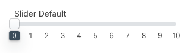

# Visual Guide to Proptypes

## Table of Contents

-   Data
    -   [bool](#bool)
    -   [category](#category)
    -   [color](#color)
    -   [editorFull](#editorfull)
    -   [editorMinimal](#editorminimal)
    -   [embeddable](#embeddable)
    -   [image](#image)
    -   [number](#number)
    -   [oneOf](#oneof)
    -   [product](#product)
    -   [slider](#slider)
    -   [string](#string)
-   Meta / Organization
    -   [arrayOf shape](#arrayof-shape)
    -   [isPrivate](#isPrivate)
    -   [readOnly](#readonly)
    -   [sectionHeader](#sectionheader)
-   More
    -   [Further Reading](#further-reading)

## Data

### bool


```js
boolean: {
    label: 'Boolean',
    type: ElementPropTypes.bool
}
```

```js
export const defaultConfig = {
    boolean: true
};
```

### category


```js
category: {
    label: 'Category',
    type: ElementPropTypes.category
}
```

In the block, `props.category` will be the ID of the category selected by the merchant.

### color


```js
color: {
    label: 'Color',
    type: ElementPropTypes.color
}
```

```js
export const defaultConfig = {
    color: 'purple' // all CSS color formats accepted
};
```

**Note:** merchant edits to color fields will are stored in RGBA format.

### editorFull


```js
editorFull: {
    label: 'Editor Full',
    type: ElementPropTypes.editorFull
}
```

```js
export const defaultConfig = {
    editorFull: '<h1>Full WYSIWYG</h1>'
};
```


### editorMinimal


```js
editorMinimal: {
    label: 'Editor Minimal',
    type: ElementPropTypes.editorMinimal
}
```

```js
export const defaultConfig = {
    editorMinimal: '<p>Minimal text editor&#8230;</p>'
};
```


### embeddable


```js
embeddable: {
    label: 'Embeddable Iframe',
    type: ElementPropTypes.embeddable({
        embedType: ElementPropTypes.string,
        url: ElementPropTypes.string,
        height: ElementPropTypes.number
    })
}
```

```js
export const defaultConfig = {
    embeddable: {
        embedType: 'iframe', // the only supported value
        url: 'https://www.volusion.com/login',
        height: 150
    }
};
```

### image


```js
image: {
    label: 'Image',
    type: ElementPropTypes.image
}
```

```js
import { ElementPropTypes } from '@volusion/element-proptypes';

export const defaultConfig = {
    image: ElementPropTypes.image.default
};
```


```js
imageWithPlaceholder: {
    label: 'Image With Default',
    type: ElementPropTypes.image
}
```

```js
export const defaultConfig = {
    imageWithPlaceholder: {
        uriBase: 'http://d21ivvgspl06jm.cloudfront.net/',
        imagePath: 'element-block-assets/slideshow/slide2.jpg',
        altText: 'Monument Valley',
        width: 1600,
        height: 500
    }
};
```


### number


```js
number: {
    label: 'Number',
    type: ElementPropTypes.number
}
```

```js
export const defaultConfig = {
    number: 42
};
```

### oneOf


```js
oneOf: {
    label: 'Dropdown',
    type: ElementPropTypes.oneOf(['News', 'Photos'])
}
```

```js
export const defaultConfig = {
    oneOf: 'News'
};
```

```js
export const defaultConfig = {
    arrayOfShapes: []
};

// or pre-populated
export const defaultConfig = {
    arrayOfShapes: [
        {
            text: 'Link',
            url: 'https://'
        }
    ]
};
```

### product


```js
product: {
    label: 'Product',
    type: ElementPropTypes.product
}
```

In the block, `props.product` will be the ID of the product selected by the merchant.

### slider



```js
sliderOptions: {
    label: 'Slider Options',
    type: ElementPropTypes.slider
}
```

```js
import { ElementPropTypes } from '@volusion/element-proptypes';

export const defaultConfig = {
    sliderOptions: {
        labelPrefix: '~',
        labelStepSize: 10,
        labelSuffix: ' oz',
        min: 50,
        max: 100,
        stepSize: 5,
        selectedValue: 75,
        vertical: false
    }
};
```

### string


```js
string: {
    label: 'String',
    type: ElementPropTypes.string
}
```

```js
export const defaultConfig = {
    string: 'Default string'
};
```

## Meta / Organization

### arrayOf shape


```js
arrayOfShapes: {
    label: 'Array of Shapes',
    type: ElementPropTypes.arrayOf(
        ElementPropTypes.shape({
            text: {
                label: 'Text',
                type: ElementPropTypes.string
            },
            url: {
                label: 'Link',
                type: ElementPropTypes.string
            }
        })
    )
}
```

### isPrivate

The `isPrivate` property set to true hides a field from merchants. Agency accounts will still be able to see it.

```js
string: {
    label: 'String',
    type: ElementPropTypes.string,
    isPrivate: true
}
```

### readOnly


```js
readOnly: {
    label: '',
    type: ElementPropTypes.readOnly
}
```

```js
export const defaultConfig = {
    readOnly: 'Read-only text.' // use for instructions, help text
};
```

## sectionHeader


```js
sectionHeader: {
    type: ElementPropTypes.sectionHeader;
}
```

```js
export const defaultConfig = {
    sectionHeader: 'Section Header'
};
```

## More

### Further reading

-   [Working with Element Proptypes Tutorial](/tutorials/proptypes/README.md)
-   [How to: Add Element Proptypes to a Block](/how-to/proptypes/README.md)
