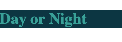
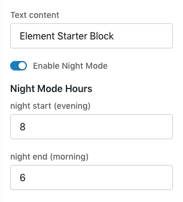

# Working with Element Proptypes Tutorial

In this tutorial we will create a block with a configurable night mode.

## Create a New Block

Create a new block named Solarized. If you haven't used element before, see [How to Set Up your Environment for Developing Blocks](/how-to/env-setup/README.md).

```shell
element new Solarized
```

## Locate the Block Configuration and Schema

Open up your block's code and find `/src/configs.js`. In that file you'll see `getConfigSchema`. This is where you tell Site Designer what configuration fields are available for your block. Store admins will be able to edit the settings of your block using those fields.

```js
export const getConfigSchema = ElementPropTypes => {
    return {
        text: {
            label: 'Text content',
            type: ElementPropTypes.string
        }
    };
};
```

## Add a New Element Proptype

In the object literal we will name the property `isNightModeEnabled`, which is how we'll reference it from the block's component code. We'll give it the `label` "Enable Night Mode" which appears above the field in the Site Designer's edit panel. For the `type` make it an `ElementPropTypes.bool`, which represents a boolean field.

```js
export const getConfigSchema = ElementPropTypes => {
    return {
        text: {
            label: 'Text content',
            type: ElementPropTypes.string
        },
        isNightModeEnabled: {
            label: 'Enable Night Mode',
            type: ElementPropTypes.bool
        }
    };
};
```

Still in `config.js`, when you add a new Element Proptype to a schema you need to give it a default value:

```js
export const defaultConfig = {
    text: 'Element Starter Block',
    isNightModeEnabled: true
};
```

## Set up "Night" And "Day" Styles

[TODO: link to Atomic CSS tutorial]
Production quality code would use [Atomic CSS](), or put these colors in `ElementPropTypes.color` configs of their own. For the purposes of this demo we'll put them in the styles for the block.

Open up `/src/getStyles.js` and replace the code with this:

```js
export const getStyles = (globalStyles, blockConfig) => {
    return {
        night: {
            color: "rgb(50,161,152)",
            background: "rgb(10,54,66)"
        },
        day: {
            color: "rgb(201,76,34)",
            background: "rgb(253,246,228)"
        }
    }
};
```

## Use the New Proptype in the Block

Open `/src/Block.js`. We'll now edit it so that it uses the new `isNightModeEnabled` prop. Any Element Proptypes that you add to the config schema will be available in the props passed to the block's component.

Locate the place where the block returns some JSX:

```html
return <h1>{props.text}</h1>;
```

Replace the code above with this:

```js
// read our new prop, and what we'll need to get our styles
const { classes, css, isNightModeEnabled, text } = props;

// use the new prop to determine which class to apply
const modeClass = isNightModeEnabled ? classes.night : classes.day;

return <h1 className={css(modeClass)}>{text}</h1>;
```

## Run the Block Locally

Make sure that you have all your dependiences loaded, and then start up the block in watch mode. Run these from terminal in your block's directory:

```shell
npm install
npm start
```

That will launch a browser window where you'll get preview of the block that will update as you make changes.


## Add a New Config Section

Now let's add a couple related fields to our schema. To give these fields some context and group them together in Site Designer we'll use a `sectionHeader`.

Back in `config.js`, inside `getConfigSchema`, add this new `sectionHeader` and two number fields below `isNightModeEnabled`.

```js
isNightModeEnabled: {
    label: 'Enable Night Mode',
    type: ElementPropTypes.bool
},
nightModeHeader: {
    type: ElementPropTypes.sectionHeader
},
nightStart: {
    label: 'night start (evening)',
    type: ElementPropTypes.number
},
nightEnd: {
    label: 'night end (morning)',
    type: ElementPropTypes.number
}
```

Update `defaultConfig` to include the text of our header, and the default values of our two new fields.

```js
isNightModeEnabled: true,
nightModeHeader: 'Night Mode Hours',
nightStart: 8,
nightEnd: 6
```

## Use `nightStart` and `nightEnd` in the Block

We're going to update the block component so that it compares the current time of day to our new `nightStart` and `nightEnd` to decide what styles to use.

In `block.js`, update the code that's reading the props so that it's getting the new `nightStart` and `nightEnd` properties.

```js
const { classes, css, isNightModeEnabled, nightEnd, nightStart, text } = props;
```

Replace the code that determines if we are in night mode:

```js
// get the current hour
const now = new Date().getHours();

// if somebody entered a night start value less than 12, assume they are using a 12 hour clock and convert it to 24 hour time.
const pmStart = nightStart < 12 ? nightStart + 12 : start;

// is it nighttime in the user's time zone?
const isNight = now >= pmStart || now < nightEnd;

// use night mode if night mode is enabled and it is nighttime
const isNightMode = isNightModeEnabled && isNight;
```

Here is what it should look like all together, without the comments:

```js
const { classes, css, isNightModeEnabled, nightEnd, nightStart, text } = props;

const now = new Date().getHours();
const pmStart = nightStart < 12 ? nightStart + 12 : start;
const isNight = now >= pmStart || now < nightEnd;
const isNightMode = isNightModeEnabled && isNight;
const modeClass = isNightMode ? classes.night : classes.day;

return <h1 className={css(modeClass)}>{text}</h1>;
```

## View the Results Locally

Go back to your browser. Now you will see either night or day styles depending on the current time:


## Preview Config Changes

To see what it will be like when store admins change the configuration of your block in Site Designer, let's change the configs going into your block. Open `/local/index.js` and find this:

```js
const props = {
  ...blockModule.defaultConfig,
  text: 'Custom prop value for local testing'
}
```

Replace the text with whatever you would like, and give it the rest of our `defaultConfig` properties from `/src/config.js`:

```js
text: 'Day or Night',
isNightModeEnabled: true,
nightStart: 8,
nightEnd: 6
```

Now change the start/end so that your local preview will switch modes. For example, if the current time is 10:00 in the morning, change the `end` to 11 so that the block still considers it nighttime.

Open your browser and see the change:



## View the Config in Site Designer

From your terminal, build and publish the block. It will prompt you to select a category, choose `Misc`.

```shell
npm run build
element publish -n "Proptypes Tutorial"
```

In your browser, go to [Site Designer](https://admin.volusion.com/designer). Edit a theme, and use the Add Block button to add your block to the theme.


Hover over the block to reveal the edit button.


Press the edit button and you'll be able to see the form generated by the config schema we've been working with.



Use the Preview button to test changes made to the Night Mode Hours.

Changes made to the block config in Site Designer to the `nightStart` and `nightEnd` fields will not update the block in real time. This is because our `isNightMode` logic above is triggered one time when the block is rendered, but is not tied to a React lifecycle event such as `componentDidUpdate`. You may preview the theme to see the changes.
